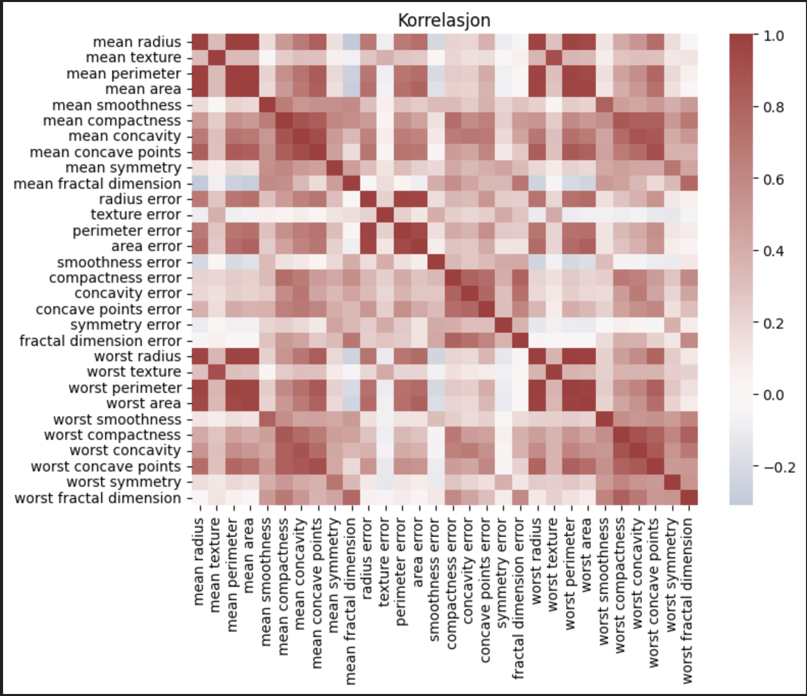
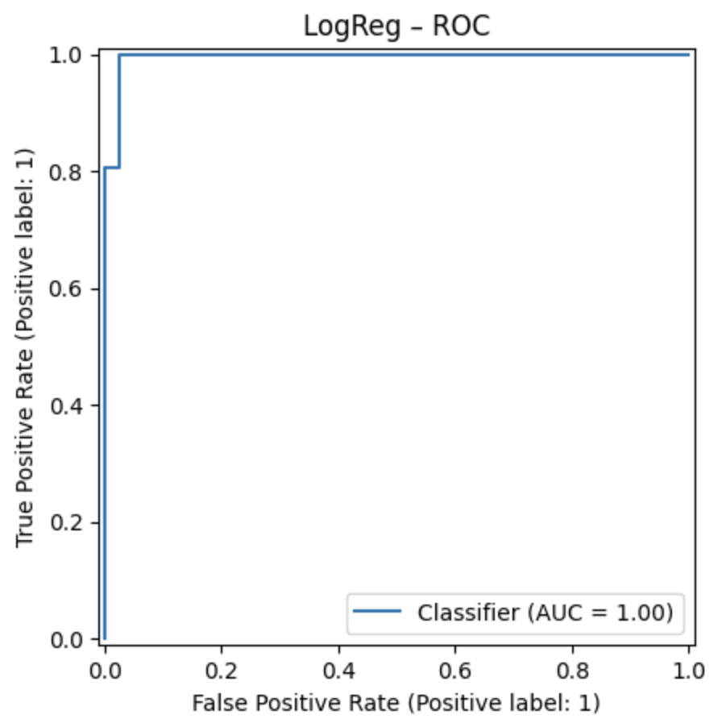
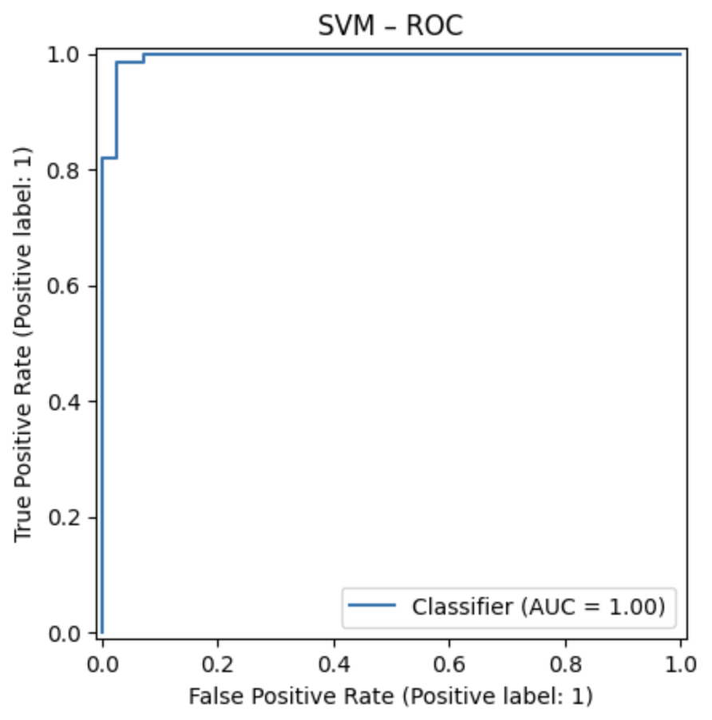
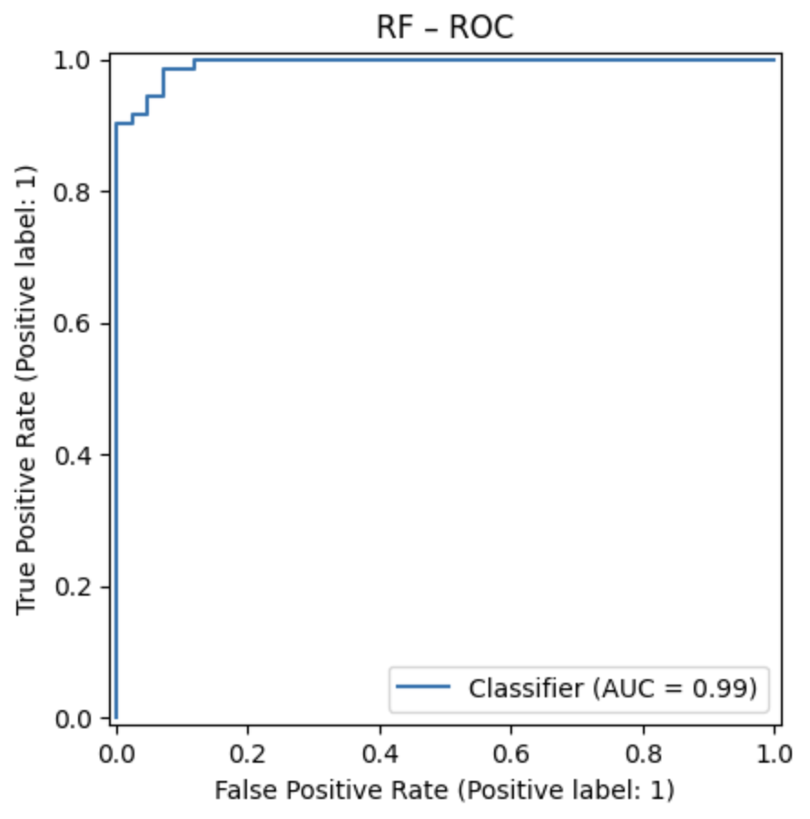

# Breast Cancer Classification

Maskinlæringsprosjekt som bruker **Breast Cancer Wisconsin (Diagnostic) Dataset** til å klassifisere svulster som **benigne (ikke-kreft)** eller **maligne (kreft)**.  
Prosjektet inkluderer **EDA (utforskende analyse)**, **baseline-modeller** og en enkel **Streamlit-app** for prediksjoner.

## Datasett
Datasettet består av **569 pasientprøver** fra fine needle aspirates (FNA) av brystsvulster.  
Fra mikroskopiske bilder er det utledet **30 numeriske features**, f.eks.:

- `mean radius` – gjennomsnittlig radius på cellekjerner  
- `mean texture` – variasjon i gråtoner  
- `concavity` – hvor “innsunket” formene er  
- `symmetry`  
- `fractal dimension`  

Hver rad i datasettet = en pasientprøve. Målet er binær klassifikasjon:  
- **0 = Malignant (kreft)**  
- **1 = Benign (ikke-kreft)**  


## Metoder
Tre klassiske maskinlæringsmodeller ble trent og evaluert:

- **Logistic Regression** – enkel, lineær modell, lett å tolke  
- **SVM (Support Vector Machine)** – finner den optimale marginen mellom klasser  
- **Random Forest** – samling av beslutningstrær, fanger opp mer komplekse mønstre og gir feature importance  

---

* **Logistic Regression (≈ 98.2 %, AUC 0.995)**

    Dette er en veldig enkel og klassisk modell. Den antar at sammenhengen mellom input (features) og output (malign/balign) kan beskrive med en "rett linje" (lineær grense). Fordelen med denne modellen er at den er lett å trene og lett å tolke. En kan se vekteen/koeffisieneten og si "Hvis radius øker, øker sannsynligheten for malign svulst". Ulempen er at modellen fungerer best når dataene faktisk er lineær separerbare (som her). Hvis data hadde vært mer komplisert, ville den kanskje slitt. 

    ⭢ På dette datasettet fungerer *Logistic Regression* ekstremt godt fordi variablene skiller benign og malign  ganske klart. 

* **SVM (Support Vector Machine) (≈ 98.2 %, AUC 0.995)**
    
    SVM prøver å finne den beste grensen (hyperplan) mellom klassene. Denf okuserer spesielt på punktene som ligger nærmest grensen (såkalte "support vectors"). Fordel er at den er en veldig kraftig for klassifisering med mange features (her:30). Ofte bedre enn Logistic Regression hvis dataene er mer komplekse. Ulempen er at modellen er veldig treg dersom det er et stor datasett. Det er også litt vanskeligere å tolke, da en ikke får like tydelig "hvilke features betyr mest". 

   ⭢ Her gjør *SVM* omtrent like bra som Logistic Regression, fordi datasettene er “pent separerbare”.

* **Random Forest (≈ 94.7 %, AUC 0.993)**

    Random Forest er en samling av mange beslutningstrær ("forest"). Hvert tre tar en beslutning, og skogen stemmer over resultatet. Fordelen er at det ikke er en lineær modell, det gjør at den fanger opp mer komplsierte mønstre. Den kan også gi deg feature importance (hvilke variabler modellen bryr seg mest om). Ulempen er at modellen er litt mindre nøyaktig på akkurat dette datasettet (men fortsatt veldig bra). Modellen er ikke så elegant dersom dataene allerede er enkel å separerer lineært. 

    ⭢ *Random Forest* gjør det litt dårligere enn Logistic Regression og SVM, men er likevell verdifull fordi den forklarer features som er viktigst. 

## Resultater
| Modell               | Accuracy | ROC-AUC |
|----------------------|----------|---------|
| Logistic Regression  | ≈ 98.2 % | 0.995   |
| SVM                  | ≈ 98.2 % | 0.995   |
| Random Forest        | ≈ 94.7 % | 0.994   |


## Viktige observasjoner 
Logistic Regression og SVM gjorde det nesten perfekt på dette datasettet.

Random Forest ga litt lavere accuracy, men nyttig innsikt i hvilke features som er viktigst.

De mest betydningsfulle variablene var bl.a. worst perimeter, worst area og worst concave points.

## Visualiseringer 
**Korrelasjonsmatrise:** 
<p>
    
</p>

**Confusion Matrix (Logistic Regression, SVM, Random Forest):**
<p align="center">
  
  
  
</p>

**ROC-kurve (Logistic Regression, SVM, Random Forest):**
<p align="center">
  
  
  
</p>

**Feature importance:**
<p>
    
</p>

## Demo-app (Streamlit)

Prosjektet inkluderer en enkel Streamlit-app der man kan fylle inn features (f.eks. radius, texture) og få en prediksjon om svulsten er **benign** eller **malign**.  
Appen bruker en trent Logistic Regression-modell i bakgrunnen.

### Kjøre appen
```bash
streamlit run app/streamlit_app.py
```

## Demo-app (Streamlit)

Eksempel på hvordan appen fungerer:


## Hvordan kjøre prosjektet 
1. Klon repoet 

```
git clone https://github.com/<ditt-brukernavn>/breast-cancer-classification.git
cd breast-cancer-classification
```

2. Installer avhengigheter
```
pip install -r requirements.txt
```

3. Kjør notebook 
```
jupyter notebook notebooks/breast_cancer_classification.ipynb
```


